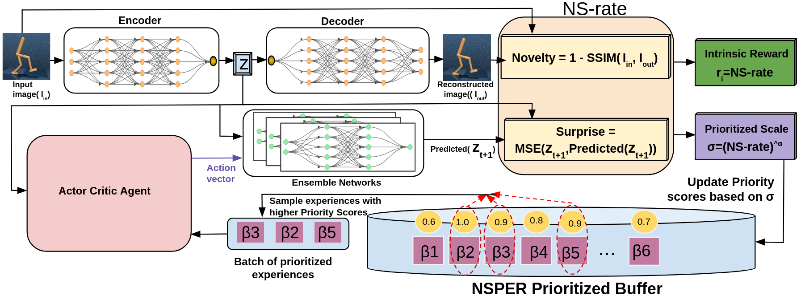

# NSPER  

This repository provides the PyTorch implementation of **Novelty and Surprise Prioritized Experience Replay in Image-Based Reinforcement Learning** (NSPER) and its variant **NSPER+R**, which integrates NSPER with intrinsic rewards. The method is incorporated into the **TD3** off-policy reinforcement learning algorithm.  

## Overview  

NSPER dynamically prioritizes experience replay based on novelty and surprise signals, improving policy learning in complex environments. Its counterpart, **NSPER+R**, further enhances exploration by incorporating intrinsic rewards. Both approaches are designed to enhance sample efficiency and policy performance in continuous control tasks.  

The algorithm is evaluated on the [DeepMind Control Suite](https://github.com/google-deepmind/dm_control), a widely used benchmark for reinforcement learning in continuous control domains.  

---

## Network Architecture  

  

The architecture integrates novelty and surprise estimations into the experience replay prioritization mechanism, optimizing policy updates within the TD3 framework.  

---

## Installation & Setup  

### Prerequisites  

Ensure you have the following dependencies installed:  

| Library  | Version |
|----------|---------|
| `pydantic` | 1.10.10 |
| `MuJoCo`   | 2.3.3 |

Install additional dependencies using:  

```bash
pip install -r requirements.txt

