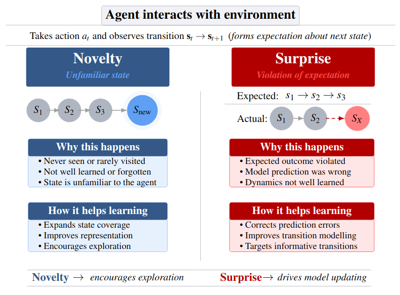
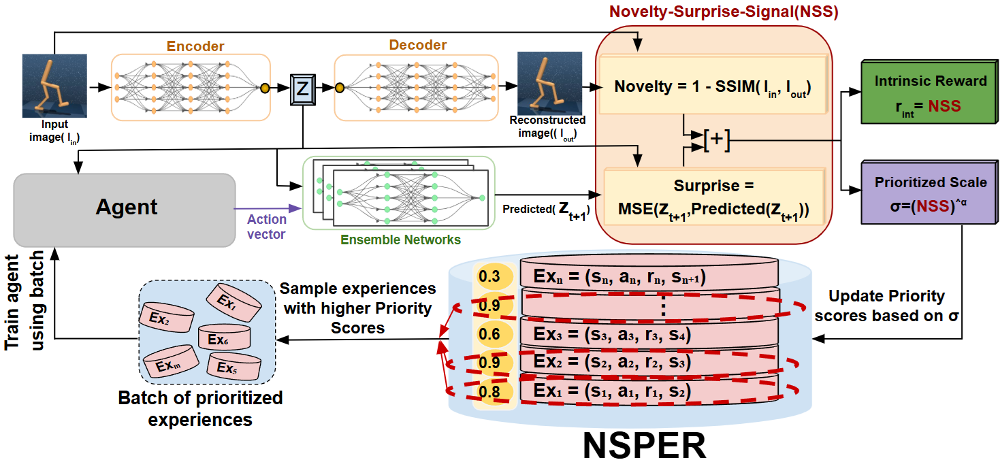

# NSPER: Novelty and Surprise Prioritized Experience Replay

[](https://arxiv.org/abs/2608.17373)
[](https://pytorch.org/)
[](https://github.com/google-deepmind/dm_control)

> **Some experiences matter more because they are unfamiliar. Others matter because they violate what the agent expected. NSPER uses both.**

**Novelty and Surprise Prioritized Experience Replay (NSPER)** is an experience replay strategy for image-based reinforcement learning that prioritizes transitions using two complementary intrinsic signals:

* **Novelty** — how unfamiliar an observation is.
* **Surprise** — how different an observed transition is from what the agent predicted.

Their combination forms the **Novelty–Surprise Signal (NSS)**, which determines which experiences are replayed more often.

**NSPER+R** goes one step further by also using NSS as an intrinsic reward, connecting **experience selection** and **exploration** through the same signal.

The method is implemented in **PyTorch**, integrated with **PixelTD3**, and evaluated on image-based continuous-control tasks from the **DeepMind Control Suite**.

---

## Why Novelty and Surprise?

Imagine an agent interacting with an environment.

Sometimes it reaches a state it has rarely or never seen before. That state is **novel**.

At other times, the state itself may be familiar, but what happens next differs from what the agent expected. That transition is **surprising**.

<p align="center">
  
</p>

These signals provide different information:

* **Novelty** encourages broader exploration and improves representation of unfamiliar states.
* **Surprise** reveals inaccurate predictions and highlights transitions that require further learning.

NSPER combines both because an informative experience may be unfamiliar, unexpected, or both.

---

## How NSPER Works

For an image observation $s_t$, the agent first learns a latent representation and reconstructs the input.

Novelty is measured as:

```math
\mathrm{Novelty}(s_t)
=
1-\mathrm{SSIM}(s_t,\hat{s}_t).
```

A poorly reconstructed observation receives a higher novelty score.

At the same time, an ensemble of dynamics models predicts the next latent state. Surprise is measured from the difference between the predicted and observed next representation:

```math
\mathrm{Surprise}(s_t,a_t)
=
\left\|
\bar{z}_{t+1}-z_{t+1}
\right\|_2^2.
```

The two signals are combined into the **Novelty–Surprise Signal**:

```math
\mathrm{NSS}(s_t,a_t)
=
\mathrm{Novelty}(s_t)
+
\mathrm{Surprise}(s_t,a_t).
```

NSPER then uses NSS instead of TD error to determine replay priority:

```math
\sigma_i
=
\mathrm{NSS}_i+\epsilon.
```

So the basic idea is:

```text
Experience
    │
    ├──────────────┐
    ▼              ▼
 Novelty        Surprise
    │              │
    └──────┬───────┘
           ▼
          NSS
           │
           ▼
   Replay Priority
           │
           ▼
   Replay More Often
```

> **Experiences that reveal gaps in the agent's representation or prediction receive greater replay attention.**

---

## NSPER+R

NSPER uses NSS only for replay prioritization.

**NSPER+R** uses the same signal as an intrinsic reward:

```math
r_t
=
r_t^{\mathrm{ext}}
+
\mathrm{NSS}(s_t,a_t).
```

This gives NSS two roles:

| Method      | Replay Priority    | Intrinsic Reward   |
| ----------- | ------------------ | ------------------ |
| **NSPER**   | Novelty + Surprise | No                 |
| **NSPER+R** | Novelty + Surprise | Novelty + Surprise |

In other words:

> **NSPER decides what the agent should learn from again. NSPER+R also encourages the agent to seek those informative experiences.**

---

## Architecture

<p align="center">
  
</p>

NSPER extends PixelTD3 with:

* an **encoder–decoder** for visual representation learning and novelty estimation;
* an ensemble of **predictive dynamics models** for surprise estimation;
* an **NSS-based prioritized replay buffer**; and
* optional **intrinsic rewards** in NSPER+R.

---

## Experiments

NSPER is evaluated on five image-based DeepMind Control Suite tasks:

* **Cartpole-Balance**
* **Finger-Spin**
* **Ball-in-Cup**
* **Walker-Walk**
* **Cheetah-Run**

The evaluation compares NSPER and NSPER+R against:

* Uniform Replay
* Uniform+R / NaSATD3
* TD-PER
* TD-PER+R
* RPE-PER
* RPE-PER+R
* CCLF

All methods use a common PixelTD3 framework for controlled comparison.

### Main Findings

* **NSPER improves PixelTD3 relative to the evaluated baselines on four of five tasks.**
* **NSPER+R achieves the strongest overall performance among the evaluated methods.**
* Novelty and surprise provide **complementary information**.
* Ablation experiments show that their combination generally performs better than either signal alone.

---

## Getting Started

Clone the repository:

```bash
git clone https://github.com/UoA-CARES/NSPER.git
cd NSPER
```

Install the dependencies:

```bash
pip install -r requirements.txt
```

Run the main experiments:

```bash
python train_loop.py
```

Ablation experiments:

```bash
python train_loop_novelty.py
python train_loop_surprise.py
```

---

## Paper

**Integrating Novelty and Surprise for Experience Prioritization and Exploration in Image-Based Reinforcement Learning**

Hoda Yamani, Henry Williams, and Bruce A. MacDonald

*International Journal of Computer and Systems Engineering*,
Vol. 20, No. 4, pp. 439–447, 2026.

 <p>
  <strong>Published paper:</strong>
  <a href="https://publications.waset.org/10014461/integrating-novelty-and-surprise-for-experience-prioritization-and-exploration-in-image-based-reinforcement-learning">
    International Journal of Computer and Systems Engineering
  </a>
</p>

 <p>
  <strong>arXiv preprint:</strong>
  <a href="https://arxiv.org/abs/2608.17373">
    arXiv:2608.17373
  </a>
</p>

---

## Citation

If you use **NSPER**, **NSPER+R**, or this repository in your research, please cite:

```bibtex
@article{yamani2026integrating,
  title     = {Integrating Novelty and Surprise for Experience Prioritization and Exploration in Image-Based Reinforcement Learning},
  author    = {Yamani, Hoda and Williams, Henry and MacDonald, Bruce A.},
  journal   = {International Journal of Computer and Systems Engineering},
  volume    = {20},
  number    = {4},
  pages     = {439--447},
  year      = {2026},
  publisher = {World Academy of Science, Engineering and Technology}
}
```

---

## Authors

**Hoda Yamani · Henry Williams · Bruce A. MacDonald**

Robot Learning Team and CARES Robotics Lab
Department of Electrical, Computer, and Software Engineering
University of Auckland, New Zealand


---

## Acknowledgements

This research was conducted within the **Robot Learning Team** and **CARES Robotics Lab** at the University of Auckland.
